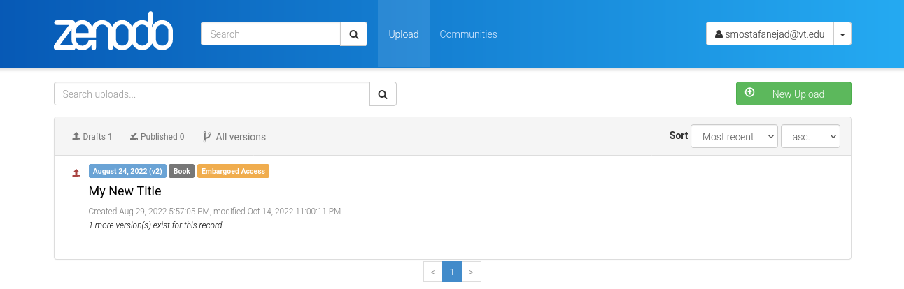
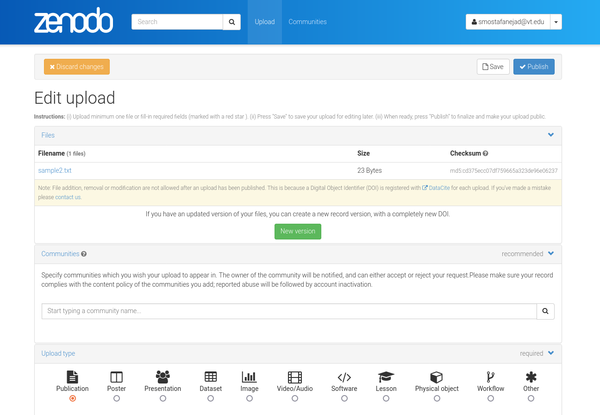
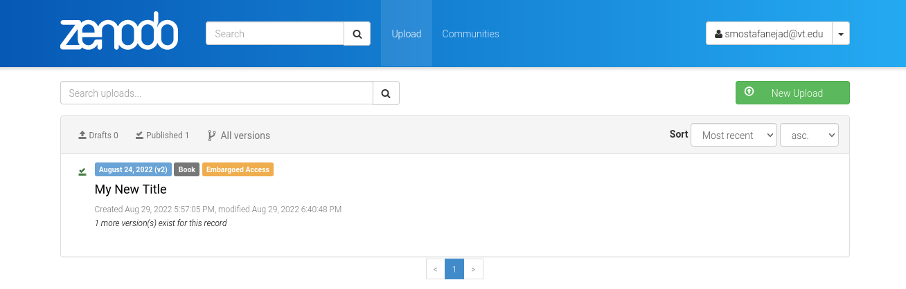

.. _act_discard:

*************************************************
How to Discard Changes Made to a Deposition Draft
*************************************************

.. note::
  
  Before going through this document, make sure you know how to create 
  an instance of the ``_DepositionActions`` class, **depo_act_obj**,
  by reviewing the :ref:`actions_howtos` guide.

In ``zenopy``, the ``discard`` action is the inverse of the ``edit`` one
explained in the :ref:`act_edit` guide: It discards all changes made in 
the deposition draft and revert its state back to that of its previous
published version.

Once again, let us focus on our mock deposition that was already 
published in our Zenodo Sandbox account. Once we changed its state
to ``inprogress``, as described in the the :ref:`act_edit` guide, it will
look like the following

The ``inprogress`` state is marked by the upward red arrow near the
title. When the deposition is in this state, clicking on its title 
takes us to the deposition form page

You should now be able to find an orange **Discard changes** button at the top-left
corner of the screen which allows you to "lock" the state of the deposition, discard
all the changes previously made during its temporary edit state and finally revert its
state back to its latest published version

        after discarding changes

The aforementioned change from **draft** to **published** state can be 
programmatically performed in ``zenopy`` by calling the ``deposition_action()``
function on an instance of the ``_DepositionActions`` class and passing
``action = discard`` as an argument

>>> my_depo = depo_act_obj.deposition_action(id_=1097408, action='discard')
>>> my_depo.data
Output exceeds the size limit. Open the full output data in a text editor
{'conceptdoi': '10.5072/zenodo.1095981',
 'conceptrecid': '1095981',
 'created': '2022-08-29T17:57:05.414428+00:00',
 'doi': '10.5072/zenodo.1097408',
 'doi_url': 'https://doi.org/10.5072/zenodo.1097408',
 'files': [{'checksum': 'cd375ecc07df759665a323de96e06237',
   'filename': 'sample2.txt',
   'filesize': 23,
   'id': '5dfbf589-a8f7-4853-81d8-1b03665f19bf',
   'links': {'download': 'https://sandbox.zenodo.org/api/files/d3b3bacd-a973-4454-95f2-c7a4441e6d97/sample2.txt',
    'self': 'https://sandbox.zenodo.org/api/deposit/depositions/1097408/files/5dfbf589-a8f7-4853-81d8-1b03665f19bf'}}],
 'id': 1097408,
 'links': {'badge': 'https://sandbox.zenodo.org/badge/doi/10.5072/zenodo.1097408.svg',
  'bucket': 'https://sandbox.zenodo.org/api/files/d3b3bacd-a973-4454-95f2-c7a4441e6d97',
  'conceptbadge': 'https://sandbox.zenodo.org/badge/doi/10.5072/zenodo.1095981.svg',
  'conceptdoi': 'https://doi.org/10.5072/zenodo.1095981',
  'doi': 'https://doi.org/10.5072/zenodo.1097408',
  'latest': 'https://sandbox.zenodo.org/api/records/1097408',
  'latest_html': 'https://sandbox.zenodo.org/record/1097408',
  'record': 'https://sandbox.zenodo.org/api/records/1097408',
  'record_html': 'https://sandbox.zenodo.org/record/1097408'},
 'metadata': {'access_right': 'embargoed',
  'creators': [{'name': 'Mostafanejad, Sina'}],
  'description': 'This is a new description',
  'doi': '10.5072/zenodo.1097408',
...
 'owner': 123811,
 'record_id': 1097408,
 'state': 'done',
 'submitted': True,
 'title': 'My New Title'}

Note that the value of the field ``state`` is now set to ``done``.

.. seealso::

  - :ref:`actions_howtos`
  - :ref:`act_edit`
  - :ref:`deposition_howtos`
