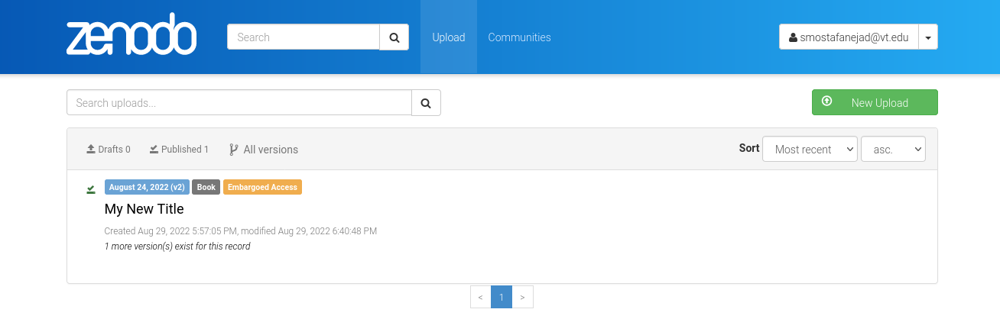
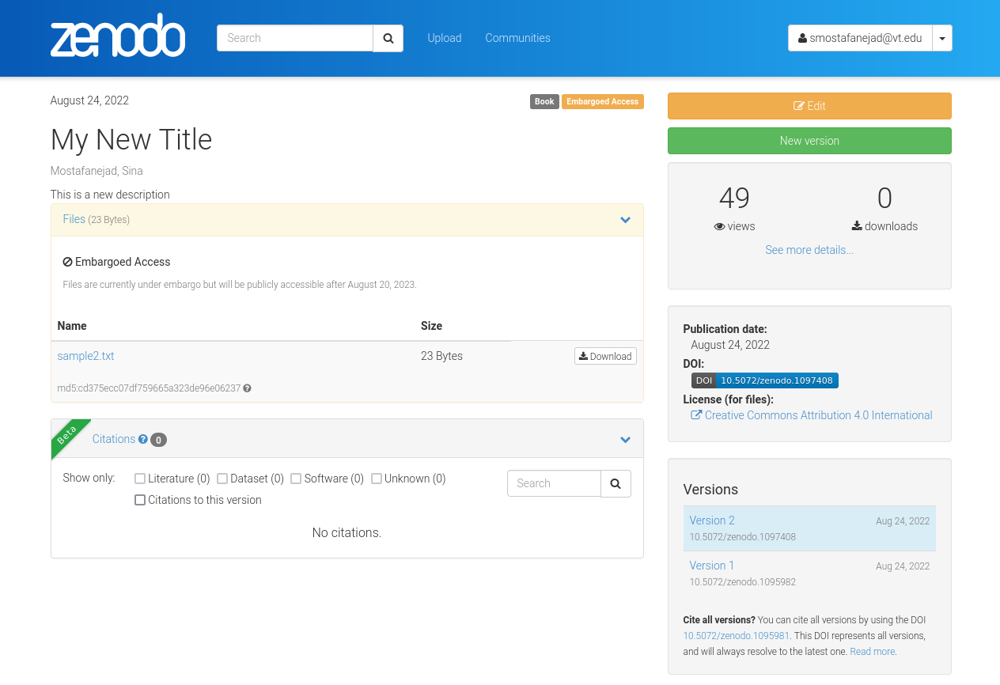
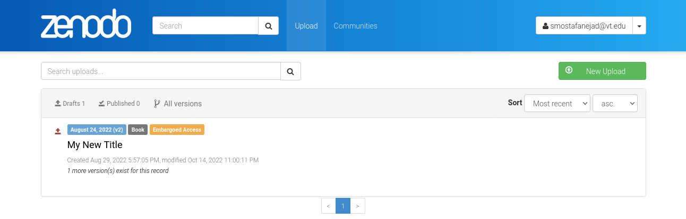

.. _act_edit:

**********************************
How to Edit a Submitted Deposition
**********************************

.. note::
  
  Before going through this document, make sure you know how to create 
  an instance of the ``_DepositionActions`` class, **depo_act_obj**,
  by reviewing the :ref:`actions_howtos` guide.

Let's consider a mock deposition in a Zenodo Sandbox account that
has been already published. A published deposition can be easily
identified with a green check mark and a blue publication date label
with a version number in parentheses besides the title as shown below.

.. tip::

  Hovering the mouse cursor on the deposition title shows its ID
  (1097408, in this case) on the status bar at the bottom-left corner
  of the screen. 

Next, click on the title to navigate to the deposition's content page

There is an orange **Edit** button at the top-right corner of the screen
which allows you to "unlock" the state of the deposition by creating a 
temporary copy of the current "locked" published version for further modifications.
The unlocked deposition, which can now be edited, is marked by a red upper-arrow
(upload) icon near its title as shown below

The aforementioned change from **published** to **draft** state can be 
programmatically performed in ``zenopy`` by calling the ``deposition_action()``
function on an instance of the ``_DepositionActions`` class and passing
``action = 'edit'`` as an argument

>>> my_depo = depo_act_obj.deposition_action(id_=1097408, action='edit')
>>> my_depo
<zenopy.record.Record at 0x7fd6f430ec20>

Now, we can inspect the contents of the record stored in the **my_repo**
variable

>>> my_depo.data
Output exceeds the size limit. Open the full output data in a text editor
{'conceptdoi': '10.5072/zenodo.1095981',
 'conceptrecid': '1095981',
 'created': '2022-08-29T17:57:05.414428+00:00',
 'doi': '10.5072/zenodo.1097408',
 'doi_url': 'https://doi.org/10.5072/zenodo.1097408',
 'files': [{'checksum': 'cd375ecc07df759665a323de96e06237',
   'filename': 'sample2.txt',
   'filesize': 23,
   'id': '5dfbf589-a8f7-4853-81d8-1b03665f19bf',
   'links': {'download': 'https://sandbox.zenodo.org/api/files/d3b3bacd-a973-4454-95f2-c7a4441e6d97/sample2.txt',
    'self': 'https://sandbox.zenodo.org/api/deposit/depositions/1097408/files/5dfbf589-a8f7-4853-81d8-1b03665f19bf'}}],
 'id': 1097408,
 'links': {'badge': 'https://sandbox.zenodo.org/badge/doi/10.5072/zenodo.1097408.svg',
  'bucket': 'https://sandbox.zenodo.org/api/files/d3b3bacd-a973-4454-95f2-c7a4441e6d97',
  'conceptbadge': 'https://sandbox.zenodo.org/badge/doi/10.5072/zenodo.1095981.svg',
  'conceptdoi': 'https://doi.org/10.5072/zenodo.1095981',
  'doi': 'https://doi.org/10.5072/zenodo.1097408',
  'latest': 'https://sandbox.zenodo.org/api/records/1097408',
  'latest_html': 'https://sandbox.zenodo.org/record/1097408',
  'record': 'https://sandbox.zenodo.org/api/records/1097408',
  'record_html': 'https://sandbox.zenodo.org/record/1097408'},
 'metadata': {'access_right': 'embargoed',
  'creators': [{'name': 'Mostafanejad, Sina'}],
  'description': 'This is a new description',
  'doi': '10.5072/zenodo.1097408',
...
 'owner': 123811,
 'record_id': 1097408,
 'state': 'inprogress',
 'submitted': True,
 'title': 'My New Title'}

You can see the field ``state`` is now set to ``inprogress``.
As such, you can treat the **my_depo** variable as a normal
deposition object.

.. seealso::

  - :ref:`actions_howtos`
  - :ref:`deposition_howtos`