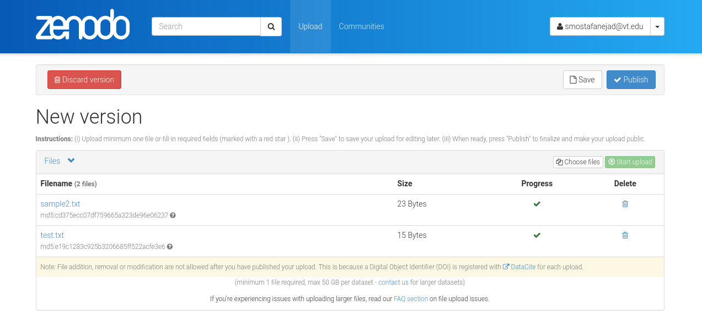
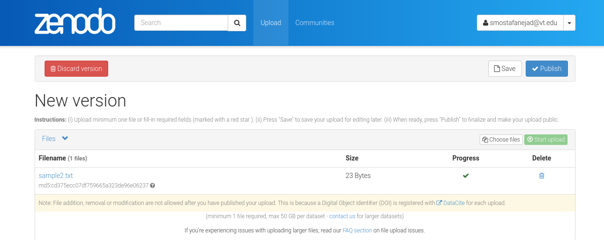

.. _file_delete:

********************************************
How to Delete a File From a Deposition Draft
********************************************

.. note::
  
  Before going through this document, please ensure that you know how 
  to create an instance of the ``_DepositionFiles`` class, **depo_file_obj**,
  by reviewing the :ref:`files_howtos` guide.

In this guide, we plan to delete the **test.txt** from a draft deposition
with the deposition ID = 1114771 that has multiple files in it. 

In order to be able to delete a file from a deposition, we need:
(i) the deposition ID (here, ID = 1114771), and (ii) the file ID 
(in this case, File ID: 84385362-b73e-4680-8fc1-2960ec82b34d).
Let's store these two IDs in two separate variables for convenience:

>>> depo_id = 1114771
>>> my_file_id = "84385362-b73e-4680-8fc1-2960ec82b34d"

Now, you can simply call the ``delete_deposition_file()`` function on 
an instance of the ``_DepositionFiles`` class (here, the instance is
stored in the **depo_file_obj** variable) and pass the aforementioned
variables as function arguments

>>> depo_file_obj.delete_deposition_file(id_=depo_id, file_id=my_file_id)
The deposition file at the following address has been deleted:
https://sandbox.zenodo.org/api/deposit/depositions/1114771/files/84385362-b73e-4680-8fc1-2960ec82b34d

Getting back to the deposition form page in your Zenodo account, you can 
see that the **test.txt** file has been deleted.

.. attention::

  You cannot delete a file from a published deposition. Instead, you should create a new version
  of the deposition first to change its state from **published** to **draft**. Then you can change
  the files (e.g., delete them) on the draft with the new version and finally, publish it. The
  new deposition will be published with its own new DOI.

.. seealso::

  - :ref:`files_howtos` 
  - :ref:`file_list`
  - :ref:`file_retrieve`
  - :ref:`file_create`