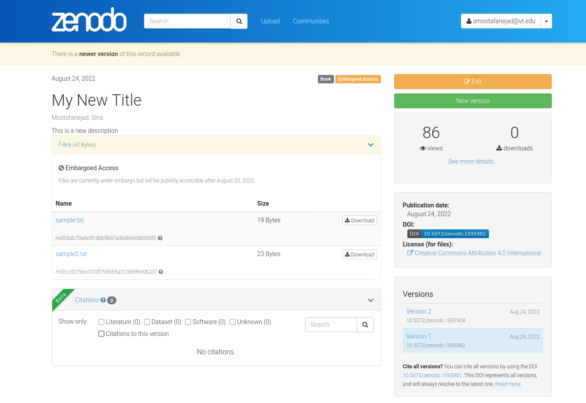

.. _file_retrieve:

*********************************
How to Retrieve a Deposition File
*********************************

.. note::
  
  Before going through this document, please ensure that you know how 
  to create an instance of the ``_DepositionFiles`` class, **depo_file_obj**,
  by reviewing the :ref:`files_howtos` guide.

In this guide, we plan to retrieve the **sample.txt** from an already published deposition
in our Zenodo Sandbox account. 

We need two pieces of information: (i) the deposition ID (here, ID = 1095982),
and (ii) the file ID (in this case, File ID: 750761a9-d589-4599-ac12-91f57b77bdc2).
Let's store these two IDs in two separate variables for convenience:

>>> depo_id = 1095982
>>> my_file_id = "750761a9-d589-4599-ac12-91f57b77bdc2"

Now, you can simply call the ``retrieve_deposition_file()`` function on 
an instance of the ``_DepositionFiles`` class (here, the instance is
stored in the **depo_file_obj** variable) and pass the aforementioned
variables as function arguments

>>> my_depo_file = depo_file_obj.retrieve_deposition_file(id_=depo_id, file_id=my_file_id)
>>> my_depo_file
<zenopy.record.Record at 0x7fca84370340>

Let's check the file name of the deposition file stored in the
**my_depo_file** variable

>>> my_depo_file.get("filename")
'sample.txt'

which shows we have received the file we were looking for.

.. tip::

  The ``retrieve_deposition_file()`` function call as shown above will retrieve and
  return the file object as an instance of the ``Record`` class. In order to download
  the file on disk, pass the absolute/relative path of the output file as 
  ``outfile_path=<path-to-output-file>`` as the third argument

  >>> my_depo_file = depo_file_obj.retrieve_deposition_file(id_=depo_id, file_id=my_file_id, outfile_path="./local_sample.txt")

  Here, we have stored the file object in the **my_depo_file** variable and downloaded and saved
  the **sample.txt** file in the current working directory ("./") after renaming the file as
  **local_sample.txt**.

.. seealso::

  - :ref:`files_howtos` 
  - :ref:`file_list`
  - :ref:`file_create`