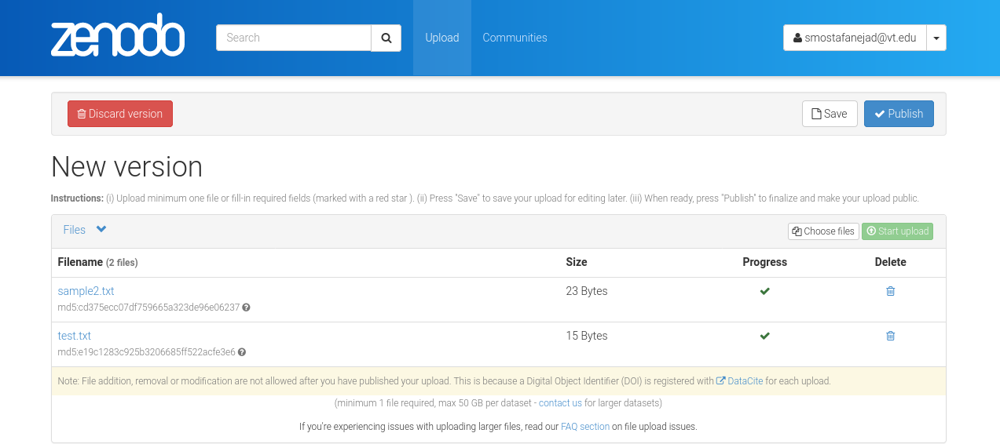

.. _file_sort:

******************************************************
How to Sort the Deposition Files in a Deposition Draft
******************************************************

.. note::
  
  Before going through this document, please ensure that you know how 
  to create an instance of the ``_DepositionFiles`` class, **depo_file_obj**,
  by reviewing the :ref:`files_howtos` guide.

In this guide, we focus on a deposition draft in our Zenodo account
with the record ID = 1114771 (see below)

First, let us list the available files in this deposition draft

>>> depo_file_list = depo_file_obj.list_deposition_files(id_=1114771)
  >>> for f in depo_file_list:
  >>>     print("[Filename]: %s; \n[File ID]: %s\n" % (f.get("filename"), f.get("id")))
    [Filename]: sample2.txt; 
    [File ID]: 5dfbf589-a8f7-4853-81d8-1b03665f19bf

    [Filename]: test.txt; 
    [File ID]: 21077a2a-d716-48a9-89e5-9b4d0465863a

The goal here is to resort the order of the aforementioned files. For this
to happen, we need (i) a deposition ID, and (ii) a list of file IDs in
the order we want them to be hosted in our deposition. Lets store this
information into two variables

>>> dep_id = 1114771
>>> file_id_list = [depo_file_list[1].get("id"), depo_file_list[0].get("id")]

where in the second command, we have reversed the order of the two file IDs.
Now, it is tile to pass these two variables to the 

>>> sorted_depo_file_list = depo_file_obj.sort_deposition_files(id_=dep_id, id_list=file_id_list)

Printing the filenames in the sorted list gives us

>>> for f in sorted_depo_file_list:
>>>     print(f.get("filename"))
test.txt
sample2.txt

Next time you retrieve the deposition, the order of the files will be similar
to what has just been printed.

.. seealso::

  - :ref:`files_howtos` 
  - :ref:`file_list`
  - :ref:`file_create`
  - :ref:`file_retrieve`