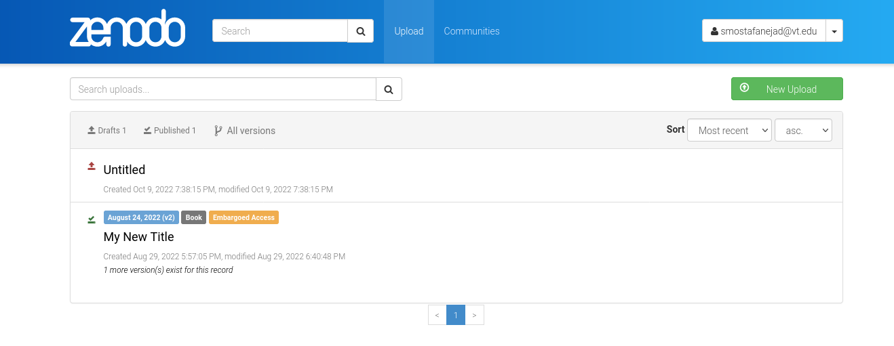

.. _depo_list:

**********************************
How to List the Zenodo Depositions
**********************************

.. note::
  
  Before going through this document, make sure you know how to create 
  an instance of the ``_Depositions`` class, **depo_obj**, by reviewing 
  the :ref:`deposition_howtos` guide.

Listing all existing depositions in your Zenodo account
is as simple as calling the ``_Depositions`` instance object's 
``list_deposition()`` function

>>> depo_list = depo_obj.list_depositions()
>>> depo_list
[<zenopy.record.Record at 0x7fd400e4ebf0>]

.. attention::

  By default, the ``list_depositions()`` function lists all depositions that
  are in the ``published`` status. You can set this property by passing the
  ``status = published`` as an argument to the ``list_depositions()`` function.

In order to list the all depositions that have not yet been published, pass the
``status = draft`` to the ``list_depositions()`` function as an argument

>>> depo_list = depo_obj.list_depositions(status="draft")
>>> depo_list
[<zenopy.record.Record at 0x7fd400e4fac0>]

Simply check the state of the obtained record by calling its ``state``
attribute

>>> depo_list[0].state
'unsubmitted'

In your Zenodo account dashboard, you can correspond the ``published`` status
to a green check mark on the top-left corner side of your deposition title card.
Similarly, the ``draft`` status is associated with a red arrow pointing upwards
as you can see in the following snapshot

.. seealso::

   - :ref:`deposition_howtos`