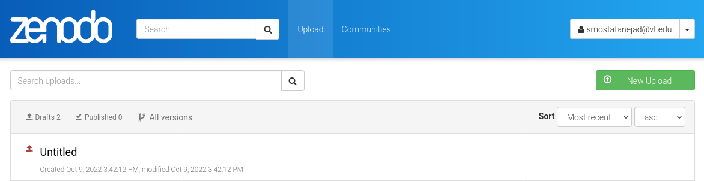
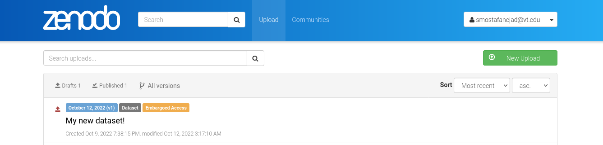

.. _depo_update:

**********************************************************
How to Update an Existing Deposition That is not Published
**********************************************************

.. note::
  
  Before going through this document, make sure you know how to create 
  an instance of the ``_Depositions`` class, **depo_obj**, by reviewing 
  the :ref:`deposition_howtos` guide.

Let's update the contents of an existing deposition in our Zenodo account. 
Our plan is to use an empty deposition form, with the ID value of 
**1112185**, that was created in the :ref:`depo_create` for a dataset
we want to publish on Zenodo

In order to update the contents of the deposition \#1112185,
we call the ``_Depositions`` class' ``update_deposition`` function
and pass the corresponding metadata as arguments

.. code-block:: python

  >>> my_updated_depo = depo_obj.update_deposition(
      id_=1112185,
      upload_type="dataset",
      title="I love using zenopy!",
      creators=[{"name":"Mostafanejad, Sina"}],
      access_right="embargoed",
      embargo_date="2023-08-20",
      license="cc-by",
      description="This is a new description for my fresh deposition."
      )

Calling the ``update_deposition`` not only returns an updated deposition
object referenced by the original deposition ID passed into it as an argument,
but also changes the contents of the corresponding deposition form in your
Zenodo account. First, let's check the contents of the updated deposition object
we got from the ``update_deposition()``

.. code-block:: python
  
  >>> my_updated_depo.data
  Output exceeds the size limit. Open the full output data in a text editor
  {'conceptrecid': '1112184',
  'created': '2022-10-09T19:38:15.289636+00:00',
  'doi': '',
  'doi_url': 'https://doi.org/',
  'files': [],
  'id': 1112185,
  'links': {'bucket': 'https://sandbox.zenodo.org/api/files/a67735cf-1d9e-41de-8555-9d1dbec72177',
    'discard': 'https://sandbox.zenodo.org/api/deposit/depositions/1112185/actions/discard',
    'edit': 'https://sandbox.zenodo.org/api/deposit/depositions/1112185/actions/edit',
    'files': 'https://sandbox.zenodo.org/api/deposit/depositions/1112185/files',
    'html': 'https://sandbox.zenodo.org/deposit/1112185',
    'latest_draft': 'https://sandbox.zenodo.org/api/deposit/depositions/1112185',
    'latest_draft_html': 'https://sandbox.zenodo.org/deposit/1112185',
    'newversion': 'https://sandbox.zenodo.org/api/deposit/depositions/1112185/actions/newversion',
    'publish': 'https://sandbox.zenodo.org/api/deposit/depositions/1112185/actions/publish',
    'registerconceptdoi': 'https://sandbox.zenodo.org/api/deposit/depositions/1112185/actions/registerconceptdoi',
    'self': 'https://sandbox.zenodo.org/api/deposit/depositions/1112185'},
  'metadata': {'access_right': 'embargoed',
    'creators': [{'name': 'Mostafanejad, Sina'}],
    'description': 'The description of my dataset.',
    'doi': '',
    'embargo_date': '2023-08-20',
    'license': 'CC-BY-4.0',
    'prereserve_doi': {'doi': '10.5072/zenodo.1112185', 'recid': 1112185},
    'publication_date': '2022-10-12',
  ...
  'owner': 123811,
  'record_id': 1112185,
  'state': 'unsubmitted',
  'submitted': False,
  'title': 'My new dataset!'}

Great. You can see every information we wanted such as **creators**,
**license**, **title**, *etc.* is now stored in the deposition object.

Next, let's check our Zenodo account to see whether these changes are reflected
in our deposition form as well.

As you can see, the deposition form in our Zenodo account has also been updated
with the corresponding information which are nicely formatted and demonstrated
on the deposition card.

.. seealso::

  - :ref:`deposition_howtos`
  - :ref:`depo_create`
   