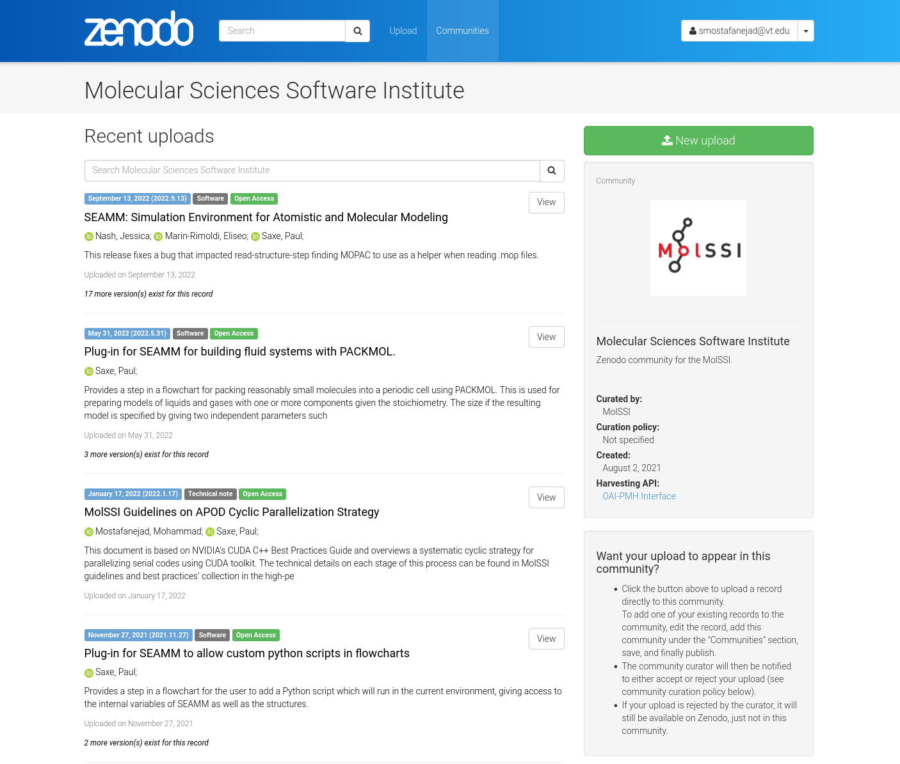

.. _rec_list:

*********************************************
How to Search Through Zenodo's Public Records
*********************************************

.. note::
  
  Before going through this document, make sure you know how to create 
  an instance of the ``_Records`` class, **rec_obj**, by reviewing 
  the :ref:`records_howtos` guide.

In order to demonstrate the search capabilities of ``zenopy``, let's consider 
a simple scenario where we want to list only those records that are publicly 
available through `MolSSI's Zenodo Community <https://zenodo.org/communities/molssi>`_ 

Since Zenodo adopts the `Elastic Search Query Syntax <https://help.zenodo.org/guides/search>`_ 
for searching through its public open-access collection of records, we can pass 
a simple search ``query`` statement to the ``list_records()`` function as follows 

.. code-block:: python

  >>> my_record_list = rec_obj.list_records(query="communities:molssi")
  >>> my_record_list

Here, the query statement involves a **field** and its corresponding **value**
in the ``field:value`` format. For a list of valid fields and values, see 
`here <https://help.zenodo.org/guides/search>`_.

The last two commands generate a series of warning messages and a list of record objects
that we stored in the **my_record_list** variable

.. code-block:: none

  The value of 'content_type' argument is None.
  ZenoPy will adopt JSON encoding.

  The value of 'status' argument is None.
  ZenoPy will search for 'published' record.

  The value of 'sort' argument is None.
  ZenoPy will sort the search results according to 'bestmatch' sort option.

  [<zenopy.record.Record at 0x7f8605f43160>,
  <zenopy.record.Record at 0x7f8605f43610>,
  <zenopy.record.Record at 0x7f8605f42c80>,
  <zenopy.record.Record at 0x7f8605f43190>,
  <zenopy.record.Record at 0x7f8605ff43d0>,
  <zenopy.record.Record at 0x7f8605ff4580>,
  <zenopy.record.Record at 0x7f8605ff42e0>,
  <zenopy.record.Record at 0x7f8605ff4160>,
  <zenopy.record.Record at 0x7f8605ff4130>,
  <zenopy.record.Record at 0x7f8605ff4190>]

These are a list of ten public records that are available in the MolSSI's Zenodo
Community. Let's use a simple loop to print the title of each record in this list

.. code-block:: python

  for rec in my_record_list:
    print(rec.title)

which gives 

.. code-block:: none

  SEAMM: Simulation Environment for Atomistic and Molecular Modeling
  Plug-in for SEAMM for building fluid systems with PACKMOL.
  MolSSI Guidelines on APOD Cyclic Parallelization Strategy
  Plug-in for SEAMM to allow custom python scripts in flowcharts
  DES5M
  DESS66 and DESS66x8
  DES370K
  DES15K
  Plug-in for SEAMM to create structures from SMILES
  MolSSI Formatting Guidelines for Machine Learning Products

.. tip::

  Instead of using the elastic search query, we could use the ``communities``
  argument in the ``list_records()`` function as

  .. code-block:: python

    >>> my_record_list = rec_obj.list_records(communities="molssi")

  to obtain the same record list.

.. seealso::

   - :ref:`records_howtos`
   - `Zenodo's Elastic Search Query Syntax Guide <https://help.zenodo.org/guides/search>`_