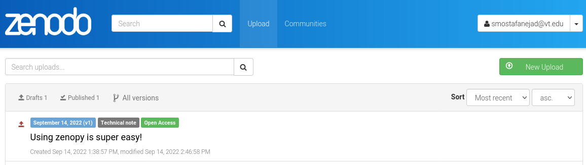

.. _quick_start:

***********
Quick Start
***********

.. contents::
   :local:
   :depth: 2

Let's get started by demonstrating how you can use ``zenopy`` in a 
few brief sections. For more details, check out our :ref:`User Guide <user_guide>`.

Access your Zenodo Account
==========================

The first step to start using ``zenopy`` is to import it

>>> import zenopy

In order to interact with Zenodo servers, we need to create a ``zenopy``
client object

>>> cli = zenopy.Zenodo()
WARNING: The config file (~/.zenodorc) is found.

Upon successful construction of the client object, ``zenopy`` issues a 
warning stating that ``zenopy`` assumes you have a config file 
(called **.zenodorc**) in your home directory. This config file should
store the token you generated from your Zenodo account and looks like
the following

.. code-block:: python

    [ZENODO]
    my_token = <token-generated-from-Zenodo-account>

If you do not know how to create a token from your Zenodo account,
see :ref:`here <cli_token>`.

Working with the Existing Depositions
=====================================

Once ``zenopy``'s client instance is initialized with your token,
it allows you to inspect the existing records corresponding to your
Zenodo account. In order to access the existing depositions on your
account, first call client's member funtion ``init_deposition()``

>>> depo = cli.init_deposition()

This command generates a ``Deposition`` class instance that allows you
to perform operations that are pertinent to the 
Zenodo `Deposition <https://developers.zenodo.org/#depositions>`_ 
`Entities <https://developers.zenodo.org/#entities>`_. 

Listing Depositions
-------------------

The ``Deposition`` class instance enables you to interact with your personal
or organization depositions. For instance, you can 
`list <https://developers.zenodo.org/#list>`_ all existing depositions 
corresponding to your Zenodo account by calling the ``list_depositions()``
on the ``depo`` instance object

>>> rec = depo.list_depositions()
>>> rec
[<zenopy.record.Record at 0x7fa129db0310>]

As the function name indicates, the result is a list of ``zenopy``'s ``Record``
object(s). In this case, the list consists of one record which mirrors the same
construction the corresponding Zenodo accont. In order to access each 
record's contents, simply call its ``.data`` attribute

>>> rec[0].data
Output exceeds the size limit. Open the full output data in a text editor
{'conceptdoi': '10.5281/zenodo.5120242',
 'conceptrecid': '5120242',
 'created': '2021-07-21T18:10:05.154930',
 'doi': '10.5281/zenodo.5120243',
 'doi_url': 'https://doi.org/10.5281/zenodo.5120243',
 'files': [{'checksum': 'b528606728a7dd0f38df17550c2773e2',
   'filename': 'gpu_programming_beginner-gh-pages.zip',
   'filesize': 3208145,
   'id': 'b65d5454-44bf-486d-ba44-46be2ca72fc2',
   'links': {'download': 'https://zenodo.org/api/files/fcacb59c-ec78-4f39-95bf-e364069fb5fb/gpu_programming_beginner-gh-pages.zip',
    'self': 'https://zenodo.org/api/deposit/depositions/5120243/files/b65d5454-44bf-486d-ba44-46be2ca72fc2'}}],
 'id': 5120243,
 'links': {'badge': 'https://zenodo.org/badge/doi/10.5281/zenodo.5120243.svg',
  'bucket': 'https://zenodo.org/api/files/0a60bd71-a171-4196-b639-44cf5cde22dd',
  'conceptbadge': 'https://zenodo.org/badge/doi/10.5281/zenodo.5120242.svg',
  'conceptdoi': 'https://doi.org/10.5281/zenodo.5120242',
  'discard': 'https://zenodo.org/api/deposit/depositions/5120243/actions/discard',
  'doi': 'https://doi.org/10.5281/zenodo.5120243',
  'edit': 'https://zenodo.org/api/deposit/depositions/5120243/actions/edit',
  'files': 'https://zenodo.org/api/deposit/depositions/5120243/files',
  'html': 'https://zenodo.org/deposit/5120243',
  'latest': 'https://zenodo.org/api/records/5120243',
  'latest_html': 'https://zenodo.org/record/5120243',
  'publish': 'https://zenodo.org/api/deposit/depositions/5120243/actions/publish',
  'record': 'https://zenodo.org/api/records/5120243',
...
 'owner': 243844,
 'record_id': 5120243,
 'state': 'done',
 'submitted': True,
 'title': 'Fundamentals of Heterogeneous Parallel Programming with CUDA C/C++'}

.. tip::
  You can also represent your record data by passing the record object to a 
  ``print()`` function.

Creating Depositions
--------------------

You can `create <https://developers.zenodo.org/#create>`_ a new deposition
draft on your Zenodo account by calling the ``create_deposition()`` on the
``Deposition`` class instance

>>> draft_depo = depo.create_deposition()
>>> draft_depo
<zenopy.record.Record at 0x7fbcc46bafb0>

which returns a new ``zenopy`` ``Record`` object allowing you to inspect 
its contents

>>> draft_depo.data
{'conceptrecid': '1104407',
 'created': '2022-09-14T13:38:57.183068+00:00',
 'files': [],
 'id': 1104408,
 'links': {'bucket': 'https://sandbox.zenodo.org/api/files/ab481ab2-45eb-44dc-96e8-65d06fed9d1b',
  'discard': 'https://sandbox.zenodo.org/api/deposit/depositions/1104408/actions/discard',
  'edit': 'https://sandbox.zenodo.org/api/deposit/depositions/1104408/actions/edit',
  'files': 'https://sandbox.zenodo.org/api/deposit/depositions/1104408/files',
  'html': 'https://sandbox.zenodo.org/deposit/1104408',
  'latest_draft': 'https://sandbox.zenodo.org/api/deposit/depositions/1104408',
  'latest_draft_html': 'https://sandbox.zenodo.org/deposit/1104408',
  'publish': 'https://sandbox.zenodo.org/api/deposit/depositions/1104408/actions/publish',
  'self': 'https://sandbox.zenodo.org/api/deposit/depositions/1104408'},
 'metadata': {'prereserve_doi': {'doi': '10.5072/zenodo.1104408',
   'recid': 1104408}},
 'modified': '2022-09-14T13:38:57.183080+00:00',
 'owner': 123811,
 'record_id': 1104408,
 'state': 'unsubmitted',
 'submitted': False,
 'title': ''}

As you can see, there are multiple deposition fields such as ``doi`` that Zenodo server has already
minted for you. Other (meta)data fields such as ``title`` and ``files`` are for you to populate.
Looking at the **Upload** tab in your Zenodo account, you should be able to verify that the
deposition draft container is created for you

.. figure:: images/quick_start/deposition_create.png
  :align: center
  :alt: Creating a deposition draft container figure

  Creating a deposition draft container

You can think of the ``Record`` objects as dictionaries or JSON objects with each element being 
a ``key : value`` pair. Let's edit the ``title`` field as an example

>>> draft_depo.data["title"] = "Using zenopy is super easy!"
>>> draft_depo.data
{'conceptrecid': '1104407',
 'created': '2022-09-14T13:38:57.183068+00:00',
 'files': [],
 'id': 1104408,
 'links': {'bucket': 'https://sandbox.zenodo.org/api/files/ab481ab2-45eb-44dc-96e8-65d06fed9d1b',
  'discard': 'https://sandbox.zenodo.org/api/deposit/depositions/1104408/actions/discard',
  'edit': 'https://sandbox.zenodo.org/api/deposit/depositions/1104408/actions/edit',
  'files': 'https://sandbox.zenodo.org/api/deposit/depositions/1104408/files',
  'html': 'https://sandbox.zenodo.org/deposit/1104408',
  'latest_draft': 'https://sandbox.zenodo.org/api/deposit/depositions/1104408',
  'latest_draft_html': 'https://sandbox.zenodo.org/deposit/1104408',
  'publish': 'https://sandbox.zenodo.org/api/deposit/depositions/1104408/actions/publish',
  'self': 'https://sandbox.zenodo.org/api/deposit/depositions/1104408'},
 'metadata': {'prereserve_doi': {'doi': '10.5072/zenodo.1104408',
   'recid': 1104408}},
 'modified': '2022-09-14T13:38:57.183080+00:00',
 'owner': 123811,
 'record_id': 1104408,
 'state': 'unsubmitted',
 'submitted': False,
 'title': 'Using zenopy is super easy!'}

.. note::

  Updating fields in the ``Record`` draft object(s) does not change the actual deposition(s)
  records on the Zenodo servers within your account. This is reflected in the ``state: unsubmitted``
  and ``submitted: False`` fields in your record data. If you have ever worked with Git system,
  you can use the analogy of the local changes which do not affect your remote repository's contents
  until you commit and push the local changes to the remote server.

Updating Depositions
--------------------

In order to update your Zenodo deposition (commit your local changes to your record draft on 
the Zenodo server), you can simply pass the minimum required information as arguments to
the ``Deposition`` class instance's ``update_deposition()``. First, let's inspect its docstring
by applying the ``?`` operator to the function name

>>> ?depo.update_deposition

which returns the following response

.. code-block:: python

  Signature:
  depo.update_deposition(
      id_: int = None,
      url: str = None,
      upload_type: str = None,
      publication_type: str = None,
      image_type: str = None,
      publication_date: str = None,
      title: str = None,
      creators: list[dict] = None,
      description: str = None,
      access_right: str = None,
      license: str = None,
      embargo_date: str = None,
      access_conditions: str = None,
  ) -> zenopy.record.Record
  Docstring: Update an existing deposition resource (deposition metadata)
  File:      ~/Packages/anaconda3/envs/.../zenopy/depositions.py
  Type:      method

To get a complete list of required and optional fields for your deposition metadata
refer to `Zenodo Documentation <https://developers.zenodo.org/#representation>`_.

Let's go ahead and update (commit) a few changes in the data field values in our 
deposition container form on Zenodo

.. code-block:: python

  >>>  draft_depo = depo.update_deposition(
       id_=1104408,
       upload_type="publication",
       publication_type="technicalnote",
       creators=[{"name":"Mostafanejad, Sina"}],
       access_right="open",
       license="cc-by",
       title="Using zenopy is super easy!",
       description="zenopy is a user-friendly tool for productivity."
       )

.. tip::

  Instead of passing the record ``id`` directly, we could extract it from the record object
  via ``draft_depo._id`` attribute.
 
Now, let's check the contents of the updated deposition object

>>> draft_depo.data
Output exceeds the size limit. Open the full output data in a text editor
{'conceptrecid': '1104407',
 'created': '2022-09-14T13:38:57.183068+00:00',
 'doi': '',
 'doi_url': 'https://doi.org/',
 'files': [],
 'id': 1104408,
 'links': {'bucket': 'https://sandbox.zenodo.org/api/files/ab481ab2-45eb-44dc-96e8-65d06fed9d1b',
  'discard': 'https://sandbox.zenodo.org/api/deposit/depositions/1104408/actions/discard',
  'edit': 'https://sandbox.zenodo.org/api/deposit/depositions/1104408/actions/edit',
  'files': 'https://sandbox.zenodo.org/api/deposit/depositions/1104408/files',
  'html': 'https://sandbox.zenodo.org/deposit/1104408',
  'latest_draft': 'https://sandbox.zenodo.org/api/deposit/depositions/1104408',
  'latest_draft_html': 'https://sandbox.zenodo.org/deposit/1104408',
  'newversion': 'https://sandbox.zenodo.org/api/deposit/depositions/1104408/actions/newversion',
  'publish': 'https://sandbox.zenodo.org/api/deposit/depositions/1104408/actions/publish',
  'registerconceptdoi': 'https://sandbox.zenodo.org/api/deposit/depositions/1104408/actions/registerconceptdoi',
  'self': 'https://sandbox.zenodo.org/api/deposit/depositions/1104408'},
 'metadata': {'access_right': 'open',
  'creators': [{'name': 'Mostafanejad, Sina'}],
  'description': 'zenopy is a user-friendly tool for productivity.',
  'doi': '',
  'license': 'CC-BY-4.0',
  'prereserve_doi': {'doi': '10.5072/zenodo.1104408', 'recid': 1104408},
  'publication_date': '2022-09-14',
  'publication_type': 'technicalnote',
...
 'owner': 123811,
 'record_id': 1104408,
 'state': 'unsubmitted',
 'submitted': False,
 'title': 'Using zenopy is super easy!'}

The changes are now reflected on the target deposition in our Zenodo account records as well

  Updating a deposition draft container

.. attention::

  Although we have committed our changes to the Zenodo servers by updating the deposition
  object, we have not yet published our draft. The status of our record is stored in
  the ``state: unsubmitted``  and ``submitted: False`` fields. The status implies two things:
  (i) We can further modify our record without the need to create a new version of our record,
  and (ii) the draft is not yet published and thus, not available/accessible to the public.

Retrieving Depositions
----------------------

In order to `retrieve <https://developers.zenodo.org/#retrieve>`_ a deposition, simply pass its
``id`` to ``retrieve_deposition()``

>>> fetched_depo = depo.retrieve_deposition(id_=1104408)
>>> print(fetched_depo)
Output exceeds the size limit. Open the full output data in a text editor
{'conceptrecid': '1104407',
 'created': '2022-09-14T13:38:57.183068+00:00',
 'doi': '',
 'doi_url': 'https://doi.org/',
 'files': [],
 'id': 1104408,
 'links': {'bucket': 'https://sandbox.zenodo.org/api/files/ab481ab2-45eb-44dc-96e8-65d06fed9d1b',
           'discard': 'https://sandbox.zenodo.org/api/deposit/depositions/1104408/actions/discard',
           'edit': 'https://sandbox.zenodo.org/api/deposit/depositions/1104408/actions/edit',
           'files': 'https://sandbox.zenodo.org/api/deposit/depositions/1104408/files',
           'html': 'https://sandbox.zenodo.org/deposit/1104408',
           'latest_draft': 'https://sandbox.zenodo.org/api/deposit/depositions/1104408',
           'latest_draft_html': 'https://sandbox.zenodo.org/deposit/1104408',
           'newversion': 'https://sandbox.zenodo.org/api/deposit/depositions/1104408/actions/newversion',
           'publish': 'https://sandbox.zenodo.org/api/deposit/depositions/1104408/actions/publish',
           'registerconceptdoi': 'https://sandbox.zenodo.org/api/deposit/depositions/1104408/actions/registerconceptdoi',
           'self': 'https://sandbox.zenodo.org/api/deposit/depositions/1104408'},
 'metadata': {'access_right': 'open',
              'creators': [{'name': 'Mostafanejad, Sina'}],
              'description': 'zenopy is a user-friendly tool for productivity.',
              'doi': '',
              'license': 'CC-BY-4.0',
              'prereserve_doi': {'doi': '10.5072/zenodo.1104408',
                                 'recid': 1104408},
              'publication_date': '2022-09-14',
...
 'record_id': 1104408,
 'state': 'unsubmitted',
 'submitted': False,
 'title': 'Using zenopy is super easy!'}

Deleting Depositions
--------------------

You can easily `delete <https://developers.zenodo.org/#delete>`_ a 
deposition **draft** from your Zenodo account using

>>> depo.delete_deposition(id_=1104408)
An unpublished deposition has been deleted at the following address:
	https://sandbox.zenodo.org/api/deposit/depositions/

Upon successful completion of this command, ``zenopy`` notifies you that
the deposition has been deleted from your account. You can verify
it by checking your Zenodo account from the web browser.